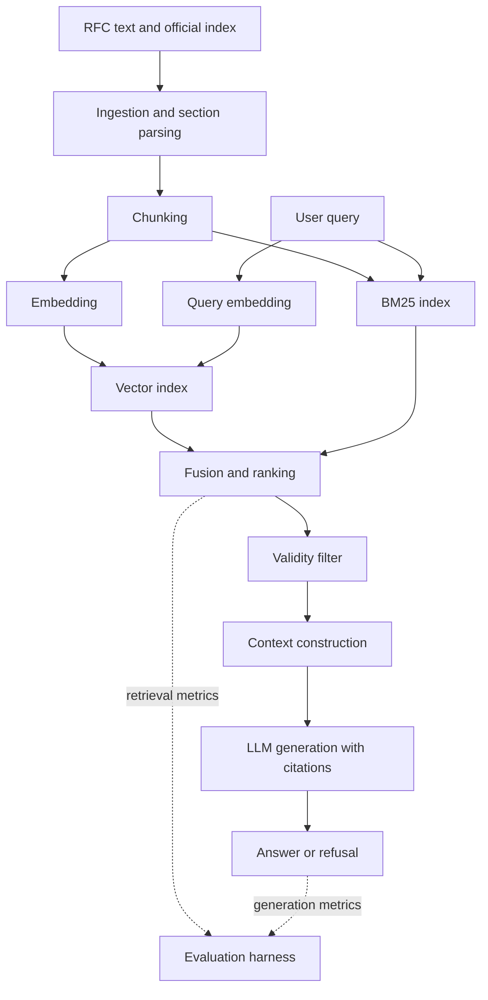

# RFC RAG Evaluation

Retrieval-augmented question answering over HTTP protocol specifications, built
as a measurement harness rather than a demo: every pipeline design decision is a
named configuration, and every configuration is scored on retrieval and on
generation separately.

> **Status: MVP in progress.** Ingestion, chunking (C0 and C1), dense
> retrieval, and the first real evaluation run (31 queries, retrieval metrics
> only) exist and are measured — see the Retrieval tables below. Generation,
> C2/C3, the full ~65-query set, latency/cost and every other table are still
> planned, not implemented; their tables stay empty with `—` until measured,
> and none of those numbers should be quoted yet.

---

## Motivation

"Can a language model answer a question from a retrieved passage?" stopped being
an interesting question some time ago. The questions that remain are the ones a
demo never has to answer: which retrieval decisions actually move answer
quality, what they cost in latency, and what the system does when retrieval is
wrong but the model answers confidently anyway.

Those questions are only sharp if the corpus makes them sharp. A folder of PDFs
does not. This project uses the HTTP specification family, because it has three
properties that a convenience corpus lacks:

1. **Documents supersede one another.** RFC 2616 (1999) was obsoleted by
   RFC 7230–7235 (2014), which were themselves obsoleted by RFC 9110–9112
   (2022). Large parts of the superseded text remain semantically near-identical
   to the current text. A retriever ranking on embedding similarity alone will
   return the 1999 wording for a question about current HTTP semantics, and the
   generator has no way to know it is reading a withdrawn document. This is a
   correctness failure that prompt engineering cannot reach, and it is invisible
   to any metric that only asks whether the retrieved passage is *on topic*.

2. **The text is identifier-dense.** `Retry-After`, status code `301`,
   `Section 9.3.1`, `RFC 9111`. The working hypothesis — to be tested, not
   assumed — is that exact identifiers like these are poorly served by semantic
   similarity alone: they are short, low-context and arbitrary, so the
   embedding of a query containing one may not place it near the passage that
   defines it. If that holds, lexical matching is a useful complementary signal
   on a real and measurable slice of the query distribution rather than a
   legacy technique. Whether it holds is an experimental question, and the
   identifier query category and the BM25 diagnostic below exist to answer it.

3. **It is deeply structured and heavily cross-referencing.** Definitions live
   in one section and are used twenty sections away. Section numbering is
   meaningful. Where you cut the document is not a formatting detail — it
   decides whether a retrieved chunk is self-contained or a fragment that has
   lost its subject.

The project question follows directly:

> On a corpus with superseding documents, dense identifiers and strong internal
> structure, how much of retrieval quality is decided by pipeline *design* —
> how documents are cut and which signals are ranked on — and how much by the
> knobs that RAG write-ups usually tune?

## Objectives

The project will investigate, in order:

1. Whether structure-aware chunking beats fixed-size windowing on a corpus whose
   structure is explicit, and on which query categories the difference shows up.
2. Whether adding a lexical retrieval signal to a dense retriever helps, whether
   any help is concentrated in identifier-style queries as hypothesised, and how
   much of that help lexical retrieval delivers on its own.
3. Whether document-validity metadata can suppress confidently-wrong answers
   sourced from obsoleted specifications by default, and at what cost in
   recall — including the cost of wrongly suppressing a query that names an
   old RFC on purpose, which is the failure mode in the opposite direction.
4. How much of the remaining error is a retrieval problem and how much is a
   generation problem — measured separately, not inferred from end-to-end
   answer quality.

Equally important, what this project will **not** do, and why:

| Not investigated | Reason |
|---|---|
| Embedding-model comparison | Swapping a checkpoint is a procurement decision, not a design one, and it is the most-reported and least-transferable RAG comparison there is. Held fixed so the experiments isolate pipeline structure. Noted as an extension. |
| Vector database comparison | At this corpus size exact search is correct and fast. Benchmarking database products would measure the products, not the retrieval design. |
| Prompt tuning | A moving target that would confound every configuration comparison. One prompt, fixed across all runs, reported verbatim. |
| Agentic / multi-hop orchestration | Out of scope at this size. The multi-section query category measures whether it *would* be needed, which is the useful precursor. |

## System Architecture

```
RFC plain text + official index
   -> ingestion:       strip page artefacts, parse the section tree, attach status metadata
   -> chunking:        fixed-window (baseline) or section-aware with header path
   -> embeddings:      one fixed sentence-embedding model (bge-small-en-v1.5)
   -> retrieval:       exact dense search, optionally fused with BM25
   -> validity filter: current vs obsoleted documents
   -> context:         assembled with per-chunk source attribution
   -> generation:      answer with citations, or explicit refusal
   -> evaluation:      retrieval metrics and generation metrics, scored separately
```



The dotted edges matter more than they look. Retrieval is scored from the
ranking, before any model sees it, so a retrieval regression cannot be masked by
a generator that happens to know the answer from pretraining.

## Dataset / Knowledge Base

The HTTP core specifications and their superseded predecessors — 16 documents,
split deliberately into a current set and an obsoleted set that covers much of
the same ground.

| Set | Documents |
|---|---|
| Current | 9110 Semantics · 9111 Caching · 9112 HTTP/1.1 · 9113 HTTP/2 · 9114 HTTP/3 · 7541 HPACK · 9204 QPACK · 6265 Cookies |
| Obsoleted | 2616 HTTP/1.1 · 7230–7235 (the six-part 2014 split) · 7540 HTTP/2 |

Why this corpus:

- **Public and stable.** RFCs are published as plain text at fixed, permanent
  URLs and do not change once issued. Reproducibility costs nothing.
- **The supersession graph is machine-readable.** `rfc-index.xml` from the RFC
  Editor carries `obsoletes` / `obsoleted-by` / `updates` relationships, so
  validity metadata is parsed from an authoritative source rather than
  hand-curated. Ingestion has a real, bounded parsing task.
- **Plain text with structure and artefacts.** Numbered section trees to parse,
  and page headers, footers and form feeds to strip — which is genuine
  preprocessing work, not busywork, because those artefacts otherwise land in
  the middle of chunks.
- **Small enough to stay honest.** Order of 1,200 pages; 1,497 parsed sections;
  4,075 chunks under C0 (fixed window) and 4,004 under C1 (section-aware),
  measured directly rather than estimated. Exact search over that is
  instantaneous on a laptop, so no result is confounded by approximate-search
  recall loss.
- **Adjacent to the rest of my portfolio.** Protocol specifications sit next to
  the systems-programming work rather than repeating the ML work.

**No document text is committed.** `scripts/fetch_corpus.py` downloads the 16
RFCs and the index, with an on-disk cache, the same pattern used in my other
repositories. This keeps the repository small and avoids redistributing text
whose terms vary by publication year.

**The obsoleted set stays fully indexed and retrievable in every
configuration, including the ones with no validity handling at all.** This is
deliberate, not an oversight: obsoleted text is what *creates* the stale-answer
failure mode, so C0–C2 need it embedded and competing for rank in order for
there to be anything to measure. If the obsoleted documents were left out of
the index entirely, the "stale evidence rate" would be zero by construction —
not because the system got anything right, but because the failure mode had
nowhere to happen. Only C3 adds a rule on top of the same index that suppresses
or down-weights obsoleted matches; the documents themselves are never removed.
This also keeps the corpus able to answer a query that names an old RFC on
purpose (see the *explicit historical version* category below) — a corpus that
had quietly dropped the obsoleted text could never do that, regardless of what
the retrieval logic asked for.

## Evaluation Dataset

Roughly **65 queries** at full size, hand-written before any retrieval output is
inspected, so that the set measures the system rather than being shaped by it.
Provenance for each query is recorded.

**The set is built in two passes, not all at once.** The MVP needs only 25–30
queries covering the first three categories — enough to measure C0 against C1
and get real numbers out of a working pipeline early. Superseded, unanswerable
and explicit-version queries are written in the second pass, once retrieval is
trustworthy and the configurations those categories exist to discriminate (C2,
C3) are actually being built. Writing all of it up front would mean spending
the first week on a benchmark for an implementation that has not yet been
validated.

| Category | Count | What it tests | Written in |
|---|---:|---|---|
| Direct factual | 20 | Single-section answer. The floor: if this is weak, nothing else matters. | MVP |
| Identifier lookup | 11 | Exact header name, status code, section or RFC number. The category that tests the lexical-retrieval hypothesis. Grown from an original 6 mid-MVP (`q027`-`q031`), because the first 6 already hit a perfect Recall@5 on C1 - a ceiling that would have left no way to tell whether C2 moves this category at all. | MVP |
| Multi-section | 12 | Evidence in two or more sections, often across documents via a cross-reference. | MVP |
| Superseded | 5 (target 10) | Answerable from both an obsoleted and a current RFC, where only the current answer is correct. The trap in one direction: assume current unless told otherwise. First 5 written as matched pairs with Explicit historical version below (`q032`-`q036`), specifically to have real data once C3 existed to test them against. | Phase 2 |
| Explicit historical version | 5 (target 6) | Names an old RFC directly (e.g. "In RFC 2616, how is chunked encoding framed?"), where the obsoleted document is the *correct* answer. The trap in the opposite direction: an over-eager validity filter must not suppress a version the user explicitly asked for. Mirrors the 5 Superseded pairs exactly (`q037`-`q041`), gold and distractor swapped. | Phase 2 |
| Unanswerable | 8 | Plausible, on-topic, and genuinely not in the corpus. Correct behaviour is refusal. | Phase 2 |

Recorded per query:

```yaml
id: q017
query: "What header field tells a client how long to wait before retrying, and what two formats can its value take?"
category: identifier_lookup
difficulty: medium
gold_sections:                  # the unit of truth - see below
  - {rfc: 9110, section: "10.2.3"}
gold_documents: [9110]
reference_answer: "Retry-After. Its value is either an HTTP-date or a number of delay-seconds."
expected_behaviour: answer      # answer | refuse
distractor_sections:            # for superseded and explicit-version queries -
  - {rfc: 2616, section: "14.37"}   # the obsoleted source that must NOT win
notes: "Tests whether the exact header-field token survives dense-only retrieval.
  (An earlier draft of this example used RFC 6585 and status 429 - verified
  against the fetched corpus and found not to exist in it; 6585 was never one
  of the 16 documents fetched. Replaced with Retry-After, confirmed present at
  this exact location in both rfc9110.txt and rfc2616.txt.)"
```

An *explicit historical version* query inverts which document is gold and
which is the distractor, versus a *superseded* one:

```yaml
id: q052
query: "In RFC 2616, how is a chunked message body terminated?"
category: explicit_historical_version
difficulty: medium
gold_sections:
  - {rfc: 2616, section: "3.6.1"}   # the obsoleted document is correct HERE
gold_documents: [2616]
reference_answer: "By a chunk of size zero, optionally followed by trailer headers."
expected_behaviour: answer
distractor_sections:                # the current RFC must NOT override the ask
  - {rfc: 9112, section: "7.1.1"}
notes: "Tests whether validity filtering (C3) over-corrects and suppresses a
  version the query named on purpose."
```

**Gold labels are at section granularity, not chunk granularity.** This is the
single most important design decision in the evaluation harness. Chunk
boundaries change between configurations, so chunk-level gold labels would have
to be re-annotated for every configuration — and the configurations would then
no longer be comparable, because each would be scored against its own labels.
Labelling the *section* that contains the evidence, and mapping every chunk to
the section(s) it overlaps at index time, makes one fixed label set valid
across all configurations.

**The chunk-to-section mapping is many-to-many, not many-to-one, in both
directions:**

- **One chunk can map to more than one section.** Overlap (C0's 150-character
  window overlap; the same mechanism reused inside C1 when a long section is
  split) means a chunk's character range can straddle two sections' boundaries.
  Measured on the real corpus (`rfc9110.txt`, sections `10.2.3`/`10.2.4`): a
  chunk landing across that boundary held 661 characters of one section and 137
  of the next — clearly evidence for both. A neighbouring chunk in the same
  sliding window held only an 11-character sliver of the first section — noise,
  not evidence.
- **One section can map to more than one chunk**, in the ordinary case, not the
  exception: 798 of 1497 parsed sections (53%) exceed C1's 1000-character split
  threshold and become several chunks. Retrieval finding *any* of them for that
  section's gold is what should count.
- **The merge case (a section under 100 characters, glued to the one after
  it)** needs one more thing to work, caught only once real chunks were built
  and measured — see the threshold rule immediately below.

**The overlap threshold is `min(100, section_length)`, not a flat 100.** A flat
100-character floor, applied uniformly, quietly makes it *impossible* for any
section shorter than 100 characters to ever be credited — not a hypothetical:
measured directly on the parsed corpus, an 86-section-strong group (`rfc9110`'s
16-character `"1.  Introduction"` among them) can never reach 100 characters of
overlap with anything, because the section itself doesn't have 100 characters
to give. The merge that's supposed to fold such a section into the next one
does happen correctly at the chunking stage — confirmed by checking that the
resulting chunk's character range starts exactly at the tiny section's own
`char_start` — but a flat threshold then silently drops it from the mapping
regardless, so it can never be scored as "found," no matter how well retrieval
performs. That is the textbook version of what the Testing section already
warns about: a bug that produces a plausible, lower-than-deserved number
instead of an error. Scaling the floor to the section's own size fixes it
without weakening the noise filter where it matters: a 920-character section
still needs a genuine 100 characters of overlap (the 11-character sliver from
the worked example above stays rejected), while a 16-character section only
needs to be found in full — exactly what a correct merge already produces.

**Scoring, precisely:** for a query with gold sections G, take the top-k
retrieved chunks, map each to every section it satisfies `min(100,
section_length)` against, and union all of that into a single set of "sections
found." `Recall@k = |sections found ∩ G| / |G|`. Note that `k` — how many
chunks were retrieved — never appears in that formula except as what bounds the
input list; it is not the denominator, and it does not grow or shrink because
some chunks happen to map to more than one section. `k` chunks can yield fewer than `k`
distinct sections (several chunks landing on the same one, the ordinary case
above) or more than `k` (several chunks each straddling two sections) — either
way, the denominator stays `|G|`, fixed by the query's own annotation. For MRR,
the rank that counts is the first chunk in ranked order whose mapped section(s)
intersect `G`.

## Retrieval Evaluation

Scored directly from the ranking, with no model in the loop.

| Metric | Why |
|---|---|
| **Recall@k** (k = 5, 10) | The primary metric. What decides whether an answer is possible at all is whether the needed evidence reached the context window. For multi-gold queries this is the fraction of gold sections retrieved, not a binary. |
| **MRR@10** | Rank position matters as soon as context is truncated, or a reranker is added downstream. Recall@k alone hides the difference between rank 1 and rank 9. |
| **Hit rate@k** | At least one gold section retrieved. A weaker complement to Recall@k, reported because for some query types partial evidence is still useful. |
| **Precision@k** | Reported, not used for decisions. With fixed k it is mechanically bounded by the gold-set size over k, so it mostly measures how many gold sections a query happens to have. |
| **Stale evidence rate** | Project-specific: share of retrieved context drawn from obsoleted documents when a current document covers the question. The metric the generic RAG stack has no reason to define, and the one this corpus exists to expose. |

All metrics reported **per category as well as overall**. An aggregate that
improves while the superseded category degrades is a regression being hidden by
an average, and the per-category table is what makes that visible.

## Generation Evaluation

> **Second phase, not the MVP.** Nothing in this section is required for the
> first milestone. Retrieval evaluation has to be working and trustworthy before
> any of it is built — a generation metric computed on top of an untrusted
> retrieval score is a number with no interpretation. In particular, the
> LLM-as-judge harness is the last thing to be implemented, not the first.

Deliberately weighted towards things that can be checked programmatically, with
model-judged metrics used only where nothing cheaper works.

| Metric | How | Objective? |
|---|---|---|
| **Citation validity** | Every answer must cite `RFC <n> §<section>`. Parse the citations; check each one exists in the context that was actually supplied. | Fully |
| **Citation relevance** | Do the cited sections intersect the query's gold sections? | Fully |
| **Refusal behaviour** | Refusal rate on the unanswerable category; false-refusal rate on answerable ones. Both matter — a system that refuses everything scores perfectly on the first. | Fully |
| **Staleness of answer** | Does the answer cite an obsoleted RFC where a current one covers the question? | Fully |
| **Answer correctness** | LLM-as-judge against the reference answer, three-level rubric: correct / partially correct / incorrect. | Judged |
| **Faithfulness** | LLM-as-judge, claim-level, with the supplied context: is every assertion supported by it? | Judged |

The two judged metrics get a reliability check rather than a free pass: I will
label a 20-query subsample by hand and report **judge–human agreement**. If
agreement is poor, the judged numbers are reported as indicative and the
objective metrics carry the conclusions. A judge whose agreement is never
measured is an unvalidated instrument.

**The generation model: local, via Ollama** (`llama3.1:8b`), not a paid API —
free, and the exact model file can be pinned for reproducibility, at the cost
of somewhat weaker generation quality than a hosted frontier model. Since
`Latency and Cost` tracks token spend only when a paid API is in use, this
path is documented by hardware and wall-clock instead (see that section).

**The prompt, verbatim** (fixed across every configuration — see the table
above on why):

```
You are a technical assistant answering questions about HTTP protocol specifications using ONLY the excerpts provided below.

Rules, follow them strictly:
1. Answer using only the information in the provided context. Do not use any outside knowledge, even if you are confident it is correct.
2. Every factual claim must be followed by a citation in exactly this format: RFC <number> §<section>. Use one citation per claim, referencing the excerpt it came from.
3. Some excerpts are marked [OBSOLETED - see RFC <n> instead]. When an excerpt without that mark covers the same point, prefer it. Use an OBSOLETED excerpt anyway only if the question explicitly names that exact RFC number.
4. If the provided context does not contain enough information to answer the question, respond with exactly this sentence and nothing else: "I don't have enough information in the provided context to answer this question."
5. Be concise. Do not repeat the question or add unrequested commentary.
```

Context is assembled as one labelled block per retrieved chunk —
`[RFC <n> §<section>]` followed by its text, chunks separated by a blank
line — so the model always has, right next to the text, the exact citation
string it is asked to reproduce.

**The validity tag is a second, independent line of defence, not a
replacement for C3.** C3's filter already decides current-vs-obsoleted at
retrieval time, before generation ever sees a candidate — if it works, the
obsoleted chunk never reaches the model at all, and there is nothing left to
decide. The tag exists for the case where it doesn't fully work: too few
non-penalised candidates to fill `k`, so an obsoleted chunk still reaches
generation. Without the tag, the model has no way to tell current from
obsoleted from the text alone — that gap *is* this project's premise, since
the wording reads nearly identically across eras. Applying the tag
identically in every configuration keeps it from confounding the C0-C3
comparison: it changes absolute generation quality everywhere at once, never
the relative ranking the ladder is built to measure. The explicit-RFC
exception in rule 3 exists for the same reason `validity_filter.py`'s regex
exemption exists on the retrieval side: an obsoleted tag must not defeat the
*explicit historical version* category twice, once at retrieval and again at
generation.

**Refusal detection is an exact string match against that fixed sentence**,
not a fuzzy "sounds like a refusal" classifier. If the model declines in
different words, that is scored as a prompt-following failure, not credited
as a correct refusal — a looser check would let inconsistent refusal phrasing
quietly pass as success.

**Citation validity is checked against what a specific call actually
supplied, never against the corpus at large.** A citation to a real, correctly-
formatted, genuinely-existing section the model was never shown for that
call is still a fabrication and scores as invalid — "sounds right" is not the
bar, "was actually in front of it" is.

Faithfulness and correctness are kept apart on purpose. An answer can be
perfectly faithful to a retrieved passage that is the wrong passage — that is
precisely the superseded-document failure, and collapsing the two metrics would
hide it. The two also diverge in the other direction, confirmed rather than
hypothetical: q044's CORS answer (Error Analysis) is likely *correct* against
general knowledge and is definitely *unfaithful* to the RFC 9112 section it
cited, which discusses request-target syntax and nothing about CORS.

**The judge, precisely.** Same model as generation (`llama3.1:8b`) - zero
extra cost, at the price of a documented self-judging bias risk, which is
exactly why judge-human agreement (below) is load-bearing here rather than
optional. Output is deliberately not strict JSON: the generator already
failed to hold an exact format under simple instructions once (the q028
refusal-with-commentary case), so the judge is asked for one fixed first
line (`VERDICT: correct` / `partially_correct` / `incorrect` for
correctness; a repeated `CLAIM: ... / SUPPORTED: yes|no` pair per claim for
faithfulness, or `NO_CLAIMS` for a refusal), parsed with a regex tolerant of
whatever commentary follows. Faithfulness is scored as the fraction of
extracted claims marked supported - `None`, not `0.0`, when there are no
claims to check at all (a refusal, or an unparseable judge response),
because "nothing failed" and "nothing was checked" are different claims and
averaging them together would silently inflate the aggregate.

## Experiments

An ablation ladder, not a grid. Each configuration adds exactly one change to
the one above it, so any difference in the table has a single named cause. Four
rungs, plus one diagnostic run that sits outside the ladder — not a
hyperparameter sweep.

| Config | Chunking | Retrieval | Validity | Question it answers |
|---|---|---|---|---|
| **C0** baseline | Fixed 800-char window, 150 overlap | Dense only, top-k 5 | none | What does the default pipeline get? |
| **C1** | Section-aware, header path prefixed, artefacts stripped | Dense only, top-k 5 | none | Does respecting document structure beat fixed windows? |
| **C2** | = C1 | Dense + BM25, fused with RRF, top-k 5 | none | Does a lexical signal help, and is the help concentrated in identifier queries? |
| **C3** | = C2 | = C2 | Obsoleted documents filtered or down-weighted | Can validity metadata remove stale answers, and what does it cost in recall? |

**C2's RRF, precisely: unweighted.** `RRF(chunk) = Σ 1/(k + rank)` over
whichever of the two ranked lists the chunk appears in, with no per-list
coefficient — dense and BM25 contribute equally. A weighted variant
(`w_dense · 1/(k+rank_dense) + w_bm25 · 1/(k+rank_bm25)`) could tune the
balance if fusion turns out to lean too far toward exact-token matches or too
far toward broad semantic similarity, but that weight is deliberately not
tuned in the main ladder — it would smuggle a second variable into what C2 is
meant to test cleanly (does fusion help at all), the same reasoning that kept
C1's prefix leaf-only. It is also not obviously a single number worth finding:
the right balance plausibly differs by query category — BM25 more useful for
identifier lookups, less so for open direct-factual questions — so a single
global weight tuned to the average query could improve one category while
quietly hurting another, exactly what the per-category reporting exists to
catch. See *Optional extensions*.

**C1's section-aware rule, precisely:** one chunk per section by default,
prefixed with **its own section number and title only** (e.g.
`"§15.3.1 200 OK > "`) — not the full ancestor path. A section longer than 1000
characters — deliberately above C0's 800, so C1 isn't just "C0 with a smaller
window" — is split further, with the leaf prefix repeated on every sub-chunk. A
section shorter than 100 characters is merged into the section that follows
rather than kept as a near-empty chunk.

Two details of that rule that only became precise once measured against the
real corpus:

- **The 100-character merge threshold applies to the section's body, excluding
  its own header line.** A header like `"4.  HTTP Frames"` costs ~17 characters
  on its own before any real content starts; measuring the raw section record
  (header included) would let a section with almost no substance — one short
  sentence after the title — survive as its own chunk just because the title
  pushed the total over 100. Measuring the body only is what the merge rule is
  actually meant to test: is there real content here, not "is the record long
  enough."
- **A short remainder left over at the end of a split section is merged
  backward, not kept as its own tiny chunk.** Splitting a long section at a
  fixed 650-character stride does not generally divide it evenly — a 1310-
  character section, for instance, splits at 0, 650 and then 1300, leaving a
  final fragment of only 10 characters. Below the same 100-character floor,
  that fragment is absorbed into the previous sub-chunk (extending it to the
  section's actual end) rather than emitted as an orphan chunk too short to be
  useful context or to satisfy the mapping threshold below on its own. This
  differs in consequence from the inter-section merge case: the *section* is
  still well represented by its other, larger sub-chunks either way; this only
  avoids wasting an index entry on a sliver no one needs.

Leaf-only, not the full breadcrumb, is a deliberate choice: prefixing every
chunk with its complete ancestor chain (e.g. "Status Codes > Successful 2xx >
200 OK") would repeat identical text across every sibling section under the
same parent, which risks diluting exactly what should distinguish their
embeddings from one another. It would also smuggle a second, untested variable
into C1 — whether chunking is section-aware, *and* how much ancestor context
gets prefixed — when the ladder is designed to change exactly one thing at a
time. Whether the extra ancestor context is worth that risk, particularly for
broad-category queries whose vocabulary lives in a parent heading and never
gets restated in the leaf section's own body text, is a real question — see
*Optional extensions*.

**Section-header detection, precisely** (confirmed against `rfc9110.txt` and
`rfc2616.txt`): a line counts as a section header only if it starts at column
0 (no leading whitespace) and matches `^(\d+(\.\d+)*)\.?\s{1,}\S`. This single
rule is what excludes the Table of Contents for free in both RFC eras — ToC
entries are always indented, in the 2022-era format (`   1.  Introduction`)
and the 1999-era one alike (`   1   Introduction .......7`) — without needing
to detect and strip the ToC block separately. The character after the number
must not be assumed to be a letter: status-code section titles start with a
digit (`15.3.1.  200 OK`, or `10.1.1 100 Continue` in the old numbering style
with a single space and no trailing dot).

**Page-artefact stripping, precisely:** only the pre-2017-ish RFCs in this
corpus (2616, and the 2014-era 7230–7235/7540) are paginated — detected by the
presence of any `\f` (form feed) byte. Current-era RFCs (9110 onward) have none
and need no stripping at all. Where present, each `\f` is flanked by a
predictable footer/header pair to discard: the last non-blank line before it
(`Fielding, et al.            Standards Track                     [Page 5]`)
and the first non-blank line after it
(`RFC 2616                        HTTP/1.1                       June 1999`).

Held fixed across all four: embedding model (`bge-small-en-v1.5`, 384
dimensions), k, prompt, generation model, temperature, and the evaluation set.
`top-k = 5` is the starting point, not a tuned value; a small k-sensitivity
check (k in {3, 5, 10}) on the best configuration is planned so that the choice
is reported as measured rather than asserted.

Two things deliberately left out of the ladder and moved to extensions: a
cross-encoder reranker and query rewriting. Both are likely to help; both would
also make it impossible to attribute a gain to the four decisions above.

### D1 — BM25-only diagnostic

One additional run, **not a rung of the ladder**, over the same section-aware
chunks as C1 and C2: BM25 alone, no dense component.

It exists to answer a single follow-up question that C2 on its own cannot:

> If hybrid retrieval improves identifier queries, how much of that improvement
> is simply lexical retrieval, and how much comes from combining the two
> signals?

Without D1, a gain from C1 to C2 is ambiguous — it could mean fusion is working,
or it could mean the dense component was contributing little on those queries all
along. The comparison that carries the answer is C1 / D1 / C2 on the identifier
category specifically.

Scope limits, so this stays a diagnostic rather than becoming a second project:

- Reported for **retrieval metrics and the per-category breakdown only**. No
  generation run, no latency or cost accounting, no error analysis pass.
- Listed separately from C0–C3 in every table, so the causal ladder stays
  readable.
- No BM25 parameter tuning. Library defaults, recorded.

## Metrics and Reporting

The tables the finished README must contain. Empty until measured.

**Retrieval**

| Config | Recall@5 | Recall@10 | MRR@10 | Hit rate@5 | Stale evidence rate |
|---|---:|---:|---:|---:|---:|
| C0 | 0.6951 | 0.8293 | 0.4858 | 0.7073 | — |
| C1 | 0.8293 | 0.9146 | 0.6260 | 0.8537 | — |
| C2 | 0.8415 | 0.8780 | 0.6182 | 0.8537 | — |
| C3 | **0.8902** | **0.9756** | **0.7364** | **0.9024** | — |
| *D1 (diagnostic)* | 0.6098 | 0.7561 | 0.4451 | 0.6829 | — |

Measured on all 41 written-so-far queries (`eval/queries.yaml`;
`unanswerable` is still unwritten - it needs the generation step to be
scoreable at all, see Roadmap). Stale evidence rate still needs a dedicated
per-query computation, not yet wired into `run_eval.py` - left blank rather
than computed as zero. `n` per category ranges from 5 to 12 - read every
number here as a first, real signal, not a settled result; bootstrap
confidence intervals are still owed per the Limitations section.

**Retrieval by query category** (Recall@5)

| Config | Direct factual | Identifier | Multi-section | Superseded | Explicit version |
|---|---:|---:|---:|---:|---:|
| C0 | 0.8333 | 0.5455 | 0.6875 | 0.6000 | 0.8000 |
| C1 | **1.0000** | 0.9091 | 0.7500 | 0.4000 | 0.8000 |
| C2 | 1.0000 | 0.9091 | **0.8125** | 0.6000 | 0.6000 |
| C3 | 1.0000 | 0.9091 | 0.8125 | **0.8000** | 0.8000 |
| *D1 (diagnostic)* | 0.8333 | 0.7273 | 0.5000 | 0.4000 | 0.2000 |

**This is the table the whole C3 design was built to answer.** The spec set
the bar for it in advance: C3 has to raise Superseded *without* dragging
Explicit version down, or it has only moved the problem, not solved it. What
happened: C2's fusion had already, by accident, weakened Explicit version
(0.8000 -> 0.6000) relative to C1 - fusing in BM25 apparently hurt the
explicit-RFC-number queries as a side effect, with no mechanism built to
protect them. C3 restores Explicit version to 0.8000 (matching C1, undoing
C2's regression) *while also* raising Superseded from C2's 0.6000 to 0.8000.
Both move the right way, at once - the explicit-RFC-number exemption
(`mentioned_rfcs()`, a plain regex against the query text) is doing exactly
the job it was written for: catch every explicit ask before the down-weight
ever applies to it, rather than hoping a lucky score survives.

D1 (BM25 alone) is worth a specific look on Explicit version: **0.2000, the
single worst number in either table.** BM25 has no notion of "this query
named an old RFC on purpose" at all - term-matching treats "RFC 2616" in the
query as just more tokens to match, with no special handling, so it has no
mechanism to prefer the explicitly-requested document the way the regex
exemption does. This is a second, independent argument for why C3's
exemption logic has to live in the retrieval/fusion layer rather than being
left to hope a raw signal carries it - not just RRF's fusion regression
(q028), but BM25 on its own has *no answer at all* to this query type.

C1's Superseded score (0.4000) landing below C0's (0.6000) is a real,
measured inversion worth flagging rather than smoothing over - with `n=5`
this is one or two queries' worth of noise, not yet a claim that C0
generalises better here. It is exactly the kind of number the eventual
bootstrap confidence intervals exist to put a size on.

C2's Identifier Recall@5 is identical to C1's (0.9091, not improved) despite
adding BM25 - not because BM25 failed on this category (D1 alone is weaker
overall, 0.7273, but gets individual queries C1 misses) but because
unweighted RRF can lose a hit either input found on its own; see the q028
worked example in Error Analysis for the specific, measured mechanism.

C3's Recall@5 is unchanged from C2 on Identifier specifically - the validity
filter only reorders candidates, it cannot pull a chunk into the top-5 that
was not already a candidate. What it does move is rank *within* the list:
q028 (GOAWAY) goes from beyond rank 10 in C2 (MRR 0.0) to rank 8 in C3 (MRR
0.125) - real progress, not visible at k=5. This is the precise, expected
boundary of what C3 was built to fix: it demoted the obsoleted RFC 7540
competitor (stale evidence), which is why the query moved at all, but RFC
9114's homonym GOAWAY was never obsoleted and so was never touched by this
filter - the residual miss is now attributable specifically to the
cross-document homonym, a different, undesigned-for failure mode.

Identifier itself was reinforced from n=6 to n=11 *before* building C2: the
original six had already reached a perfect 1.0 Recall@5 on C1, a ceiling that
would have left no way to tell whether C2 improves this category or simply
can't move a number that's already maxed out. The five queries added
(`q027`-`q031`) were picked blind to any C2 result, since C2 did not exist
yet - the same discipline as writing gold labels before inspecting retrieval
output.

Unanswerable has no column here — there is no gold section to recall against a
query with no answer in the corpus. It is scored on generation instead
(refusal rate, below).

D1 appears in the retrieval tables only. It is not run through generation, so it
has no row in the generation or latency tables below.

**Generation**

| Config | Answer correctness | Faithfulness | Citation validity | Citation relevance | Refusal on unanswerable | False refusal | Stale answers |
|---|---:|---:|---:|---:|---:|---:|---:|
| C0 | — | — | — | — | — | — | — |
| C1 | — | — | — | — | — | — | — |
| C2 | — | — | — | — | — | — | — |
| C3 | 1.0000 | 0.8527 | 0.9390 | 0.7724 | 0.7500 | **0.0000** | — |

C3 only so far, `k=10`, `llama3.1:8b` as both generator and judge, 49
queries. **False refusal is 0.0000 across all 41 answerable queries** - the
model never declined a question it had a real answer for. Refusal on
unanswerable is 0.75 (6/8) - the two misses are worked examples in Error
Analysis, and are two different kinds of failure, not the same one twice.

Citation validity (0.9390) and citation relevance (0.7724) were both
corrected from an earlier, wrongly-inflated 0.9878/0.8211: `citation_validity`
and `citation_relevance` used to return a vacuous `1.0` for *any* answer with
zero citations, including a substantive, non-refusal answer that simply
failed to cite anything - the rule the prompt actually requires. Caught via
`q032`, a correct-sounding GOAWAY answer with `"citations": []` that was
silently scoring a perfect 1.0/1.0. Fixed to only award the vacuous `1.0`
when the answer is a genuine refusal (nothing to be wrong about); a
substantive answer with no citations now scores `0.0` on both. Only two of
41 answered queries (`q009`, `q032`) were affected, but the aggregate is
reported here as the corrected value, not the original one.

Answer correctness (1.0000) is the corrected number after fixing an
ambiguity in `CORRECTNESS_PROMPT` (see "Judge-human agreement" below) - the
first run scored 0.8537, with several `partially_correct` verdicts that
turned out, on human review, to be judge over-strictness rather than real
answer defects (the judge was penalizing omission of report detail the
question itself never asked for). **A `mean_correctness` of exactly 1.0
across all 41 queries is a strong claim, and this project's own discipline
requires flagging it rather than reporting it flat**: only 20 of the 41 have
an independent human label to check it against (see below); the other 21 are
indicative, not verified. Faithfulness (0.8527) is unaffected by the prompt
fix and unchanged from the previous run - it uses a separate prompt that
was not touched. The faithfulness number itself was caught and corrected once
already, independently: the first real run reported 12 of 41 (~29%) as
unparseable, traced to a real bug in `parse_faithfulness()` - it checked for
the literal string `NO_CLAIMS` anywhere in the judge's output before checking
for actual `CLAIM`/`SUPPORTED` pairs, so a judge response with 17 genuine,
parseable claims (`q001`) was discarded whenever `llama3.1:8b` also appended
a spurious trailing `NO_CLAIMS` after them, a real and apparently not-rare
model quirk. Fixed to check for real pairs first; the corrected run has zero
unparseable faithfulness judgements.

**Judge-human agreement.** A stratified 20-query subsample
(`eval/human_agreement_worksheet.md`) was independently labelled by hand for
both metrics and compared against the judge's verdicts on the same queries
(`results/validity_c3/judge_metrics.json`):

| Metric | Agreement (20-query sample) | Note |
|---|---|---|
| Answer correctness (exact 3-way label match) | 20/20 (100%) | after the `CORRECTNESS_PROMPT` rubric fix below |
| Answer correctness, before the fix | 13/20 (65%) | judge over-used `partially_correct` |
| Faithfulness (within ±0.2 of human's 0-1 fraction) | 13/20 (65%), MAE 0.156 | unaffected by the correctness fix |

The first correctness run disagreed with the human label on 7/20 queries
(`q003, q007, q009, q021, q023, q032, q036`), always in the same direction -
the judge marking `partially_correct` where the human marked `correct`,
never the reverse. Reading the disagreements: the judge was penalizing
generated answers for omitting supporting detail the *reference* answer
happened to include but the *question* itself never asked for - not a
factual error, a stricter reading of "complete" than a human grader applied.
`CORRECTNESS_PROMPT` was amended to state explicitly that `partially_correct`
applies only when the omission is something the question itself asked about.
Re-running the judge with the amended prompt resolved every one of the 7
disagreements (now 20/20), with the generation answers themselves unchanged
(`temperature=0`, so re-generation was unnecessary - only the judge was
re-run). Faithfulness agreement is unchanged at 65% (MAE 0.156, worst cases
`q001`: human 1.0 vs judge 0.41, `q009`: 1.0 vs 0.57, `q030`: 1.0 vs 0.64) -
this metric's prompt was not touched, and this gap is reported as a real,
unresolved limitation of the LLM-judge for faithfulness specifically, not
smoothed over by the correctness fix. **Conclusion:** correctness numbers
above are now validated on the sampled 20/41 (100% agreement) and indicative
on the rest; faithfulness numbers remain indicative throughout, per the
self-judging-bias caveat already stated in `src/generation/judge.py`.

**Latency and cost**

| Config | Retrieval median | Retrieval p95 | Generation median | Generation p95 | End-to-end median | End-to-end p95 |
|---|---:|---:|---:|---:|---:|---:|
| C3 | 0.128s | 13.87s* | 65.98s | 87.53s | 67.89s | 87.66s |

Measured on 15 queries (`src/evaluation/measure_latency.py`), local Ollama
`llama3.1:8b`, CPU. \*Retrieval's p95 is a single-sample artefact, not a real
tail latency: the first query in the run pays a one-time cold start loading
`bge-small-en-v1.5` from disk (13.87s), and every subsequent query in the
same run is 0.1-0.26s - the same cost already diagnosed and fixed with
`@lru_cache` in `dense_search._load_model()` for repeated calls within one
process, but unavoidable on the very first call. Excluding that one outlier,
retrieval's own p95 across the remaining 14 queries is ~0.26s.

**Generation dominates end-to-end latency by roughly two and a half orders of
magnitude** over steady-state retrieval (66s vs 0.13s median) - the
chunking/retrieval design choices compared throughout this project have no
practical effect on user-facing latency; the cost is entirely the local
8B-parameter generation step. This is the actual answer to "what is the
quality/latency trade-off here?": there isn't one, in this setup - C0 through
C3 differ in retrieval quality, not in speed, since retrieval is not the
bottleneck. No `$` cost table is reported - this project runs entirely on a
local model, not a metered API, so cost is latency and hardware, not billing.

**k-sensitivity.** The best configuration (C3) retrieved once at `k=20` per
query and scored at every `k` in `{3, 5, 10, 15, 20}`
(`src/evaluation/run_k_sweep.py`), confirming the anecdotal `q028` finding
(Error Analysis) as a general pattern, not a one-off:

| k | Recall | Hit rate |
|---:|---:|---:|
| 3 | 0.8171 | 0.8537 |
| 5 | 0.8902 | 0.9024 |
| 10 | 0.9756 | 0.9756 |
| 15 | 0.9878 | 1.0000 |
| 20 | 0.9878 | 1.0000 |

The steepest gain is 5→10 (recall +0.0854), not 3→5 - `k=10` (this project's
default throughout) is close to the point of diminishing returns, but not
past it: `explicit_historical_version` and `superseded` are still at 0.60
recall at `k=3` and only reach 1.0 at `k=10`, meaning both categories rely on
the wider `k` to surface the gold section past competing obsoleted or
homonymous documents ranked ahead of it - consistent with the stale-evidence
and cross-document-homonym failure modes described in Error Analysis.
`multi_section` never reaches perfect recall even at `k=20` (0.9375) - the
one category where widening `k` alone does not close the gap.

Every table is to be generated from `results/` by a script, never typed by hand.

## Error Analysis

Every failing query in the best and worst configurations gets read and assigned
one category. This is the part that produces the things worth saying in an
interview, and it cannot be automated.

| Category | Definition |
|---|---|
| Document miss | No chunk from the correct document retrieved at all. |
| Ranked too low | Correct chunk retrieved, but below the cut-off. |
| Chunk boundary failure | The gold section was split so that the answer sits across two chunks and neither is self-contained. |
| Context incomplete | Right section, but the answer needs a definition or cross-reference that was not retrieved. |
| Stale evidence | Obsoleted document retrieved and used where a current one covers the question. |
| Cross-document homonym | Two *unrelated* documents (siblings, not one superseding the other) happen to share a term, code or name; distinct from stale evidence, which is specifically about currency between versions of the same thing. |
| Hallucination despite correct context | Correct evidence present; answer still wrong. A generation failure, not a retrieval one. |
| Unsupported but answered | Out-of-corpus question answered instead of refused. |
| Citation laundering | The answer draws on outside knowledge but attaches a citation to a real, genuinely-supplied section whose content does not actually support the claim - passes `citation_validity` (the section was in context) while still being a hallucination. Distinct from "hallucination despite correct context", where the cited section *is* the right one and the model still gets it wrong; here the section is wrong but present, which validity-checking alone cannot see. |
| Near-miss scope, not fabrication | A genuinely retrieved, genuinely accurate citation answers an adjacent question, not the one asked (e.g. a TLS parameter confused with a similarly-named but different one). Not a hallucination and not a retrieval bug - a precision gap in what the query itself was verified against, worth fixing in the eval set rather than the system. |
| Misattributed citation | The answer's fact is correct, and the correct gold section was genuinely present in the context supplied - but the model cited a different, unrelated section instead of the one that actually states the fact. Distinct from citation laundering (no outside knowledge involved here, the fact came from the right document) and from near-miss scope (the fact itself is exactly right, not an adjacent parameter) - the failure is purely in which section got named. |
| Ambiguous query | The query admits more than one reasonable reading, and the gold label picked one. An evaluation-set defect, to be recorded rather than quietly fixed. |

Counts per category, per configuration, with two or three worked examples
reproduced in full.

**Three real worked examples, from the first MVP run and the first C2/D1 run:**

- **Ambiguous query — q020.** Both configurations missed this multi-section
  query entirely (gold at ranks 66 and 316 in C1's dense ranking). The two
  gold sections describe two different mechanisms — one where the
  application decides to close an HTTP/3 connection, one where the transport
  reports closure to it — but the original query asked for "the two ways the
  *transport layer* can end" the connection, which only actually describes
  one of the two gold sections. Rewording to name both mechanisms neutrally
  closed the gap between their ranks from 250 to 18 (66 vs 316 → 99 vs 117) —
  confirming the asymmetry was the query's own framing, not a system fault —
  but did not fix the retrieval miss itself: both sections still rank far
  outside any reasonable top-k after the reword. Recorded as a genuinely hard
  case now that the bias is removed, not a solved one.
- **Ranked too low, with a chunking explanation — q026** (400 vs 404). C0
  never finds either gold section within the top 10 (ranks 14, 34 and 100,
  every one of those chunks a fixed window mixing 2-3 unrelated status codes
  together — e.g. one chunk spans sections 15.5, 15.5.1 *and* 15.5.2 at once).
  C1 finds 400 at rank 2 in a chunk containing only that one status code, and
  404 at rank 14 - just outside the cutoff, but an order of magnitude closer
  than C0's equivalent miss. The same mechanism as the identifier-lookup
  result below: a fixed window that crams several unrelated facts into one
  chunk dilutes the embedding of each; a chunk bounded to one section does
  not.
- **Cross-document homonym, and a real fusion regression — q028** ("What
  frame type value identifies a GOAWAY frame in HTTP/2?", gold RFC 9113
  §6.8). Dense alone (C1) misses it entirely (rank 16, outside its own
  top-5). BM25 alone (D1) finds it perfectly (rank 5, Recall@5 = 1.0). C2 -
  dense and BM25 fused with unweighted RRF - **also misses it**, the fusion
  actively losing a hit either input signal contributed on its own. Why:
  the corpus contains not two but *three* legitimate "GOAWAY" sources
  competing for this query - the current RFC 9113 §6.8 (gold), the obsoleted
  RFC 7540 §6.8 (same protocol, prior version - stale evidence), and RFC
  9114 §7.2.6, HTTP/3's *own*, unrelated GOAWAY frame, also type=0x07, a
  sibling document that happens to reuse the name and the code, not a
  superseding one. In the fused ranking, 9114 §7.2.6 takes ranks 1 and 2 and
  the obsoleted 7540 §6.8 takes rank 3, all ahead of the gold - unweighted
  RRF rewards moderate agreement across both signals over one signal's
  strong single conviction, and with three near-duplicate competitors
  splitting that moderate agreement across dense and BM25, the correctly-
  identified chunk from D1 alone never surfaces in the fusion. This is the
  concrete case that motivates the weighted-RRF extension already noted
  under Optional Extensions and Experiments - not a hypothetical concern
  about the unweighted default, a measured instance of it.

  **Follow-up under C3.** The validity filter demotes RFC 7540's competing
  chunk (obsoleted, and 9113 - its replacement - is present among the
  candidates), which is precisely the stale-evidence half of this query's
  problem. Effect: the gold moves from beyond rank 10 (MRR 0.0 under C2) to
  rank 8 (MRR 0.125) - real, measured progress, still short of the top-5.
  RFC 9114's homonym GOAWAY is left untouched, correctly - it was never
  obsoleted, so the filter has no basis to move it, and it still occupies
  the ranks the demoted 7540 chunk vacated. The residual failure is now
  attributable specifically to the cross-document homonym, cleanly
  separated from the stale-evidence portion C3 already fixed - exactly the
  boundary the filter was designed to have, not a shortfall in it.

  **Resolution under generation, with a real k-sensitivity finding along the
  way.** At C3's own `k=5`, RFC 9113 (rank 8) still isn't in the context
  handed to generation at all - the model was tested anyway with `k=5` on
  C2 first, where the context held only the homonym (9114) and the
  obsoleted competitor (7540). It correctly noticed the OBSOLETED tag on
  7540 and hesitated to answer from it - but then broke the exact-refusal
  format by appending its own explanatory note, which the strict string
  match correctly scores as a prompt-following failure, not a valid
  refusal (llama3.1:8b, run locally, is noticeably less reliable at exact
  literal formatting than a larger model would be - a real, measured cost
  of the local-model choice). Widening to C3's `k=10` puts RFC 9113 in the
  context alongside the others, and generation answers cleanly: `"0x07
  (RFC 9113 §6.8)"`, citation validity and relevance both 1.0 - correctly
  ignoring the homonym and the (still-present, still-tagged) obsoleted
  chunk. The full pipeline resolves what no single layer did alone,
  precisely because each layer's job was scoped narrowly: C3 gets the
  right answer *into range*, the validity tag helps generation *choose it*
  once it's there. This is also the first concrete, measured argument for
  the planned k-sensitivity check (Roadmap) - `k=5` and `k=10` gave
  different *correctness*, not just different recall numbers, on the exact
  same query.
- **Citation laundering — q044** ("What headers does a browser send in a
  CORS preflight request?", `unanswerable`). The model answered with a
  textbook-accurate CORS header list (`Origin`, `Access-Control-Request-Method`,
  `Access-Control-Request-Headers`) - clearly outside knowledge, since CORS
  does not exist anywhere in this corpus - and cited `RFC 9112 §3.2.1` for
  it. That section is genuinely in the corpus and was genuinely in this
  call's context, so `citation_validity` scores it 1.0 - but its actual
  content is the `origin-form` request-target syntax, unrelated to CORS
  entirely. `citation_validity` checks membership (was this section
  supplied), not support (does this section's content back the claim), and
  a hallucination with a real citation attached passes the first check
  while failing the second. This is the concrete, measured reason
  `faithfulness` has to be a separate metric rather than a cheaper stand-in
  for it - a metric this project has not implemented yet, and precisely the
  kind of failure it would exist to catch.
- **Misattributed citation — q016** ("What single-byte value identifies a
  SETTINGS frame in HTTP/2?"). The answer states `0x04` for SETTINGS, which is
  correct, and the gold section (`RFC 9113 §6.5.1`, which literally states
  "Type (8) = 0x04") was genuinely retrieved and present in the context, at
  rank 2. But the model cited `§4.1` ("Frame Format") instead - a real,
  present, but generic section that does not itself state the SETTINGS type
  code. `citation_validity` scores this 1.0 (§4.1 really was supplied) and
  the fact itself is right, so this failure is invisible to every metric
  already implemented; it was only found by reading the answer against its
  own context by hand. No outside knowledge was used (unlike citation
  laundering) and no adjacent parameter was confused (unlike near-miss
  scope) - the model simply named the wrong section for an otherwise
  correct, well-supported claim.
- **Cross-document homonym recurs outside identifier_lookup — q032**
  ("What does the GOAWAY frame allow an HTTP/2 endpoint to do?",
  `superseded`). The same RFC 9114 (HTTP/3) GOAWAY homonym documented under
  `q028` above resurfaces here: 7 of the top-10 retrieved chunks are RFC 9114
  sections, for a question specifically about HTTP/2. The model's answer was
  factually accurate but, in the run that surfaced this query, cited nothing
  at all - the real case that motivated the `citation_validity`/
  `citation_relevance` vacuous-1.0 fix documented under Generation results
  above. Recorded here as confirmation that the homonym problem is a
  property of the corpus (two unrelated protocols reusing the same frame
  name and type byte), not a one-off tied to `q028`'s specific phrasing -
  it appears in a different query category entirely.
- **Near-miss scope, not fabrication — q042** ("What is the maximum
  recommended TLS certificate key size for HTTP/2 servers?", `unanswerable`).
  The model answered "RFC 9113 §9.2.1 states that clients MUST accept DHE
  sizes of up to 4096 bits" - and that section genuinely says exactly that.
  The failure is narrower than it looks: DHE key size (an ephemeral
  key-exchange parameter) is not the same thing as a certificate's own key
  size, and the model conflated two adjacent TLS parameters rather than
  fabricating anything. This is a defect in how this query was verified, not
  in the model or the retrieval: absence was checked by grepping for
  "certificate key size" (zero matches, confirmed at the time), but that
  check does not rule out a *semantically adjacent* real parameter existing
  under different wording - exactly what TLS key-size terminology has. The
  lesson generalises beyond this one query: verifying a topic's absence by
  keyword takes real, if unlikely, risk of missing a confusable neighbour a
  keyword search cannot see.

## Latency and Cost

Measured on C3 (`src/evaluation/measure_latency.py`, 15 queries): retrieval
and generation timed separately, not just end-to-end, because the trade-off
argument depends on knowing which stage the time actually went to. Results
and interpretation are reported under Metrics and Reporting → "Latency and
cost" above, not duplicated here.

The originally planned per-stage granularity (embedding vs. dense search vs.
BM25/fusion vs. validity filtering as separate timings) was scoped down to
two stages - retrieval (everything before the context is assembled) and
generation - once the actual numbers showed generation dominating end-to-end
latency by roughly two and a half orders of magnitude. Splitting retrieval's
sub-millisecond-to-low-millisecond internals further would not have changed
that conclusion, so it was not built. Only C3 was measured, not C0-C2: since
retrieval time is not the bottleneck at any of these configurations, a
cross-config latency comparison would not tell a different story than the
retrieval-quality tables already do.

**Cost.** No `$`-priced cost table - this project runs entirely on a local
Ollama model (`llama3.1:8b`), not a metered API, so there is no per-token
price to report. The real cost here is latency and local hardware time,
which is what the measured table reports; an unpriced local run is not free,
and reporting wall-clock instead of a dollar figure is the honest version of
that, not an omission.

## Testing

Small and targeted. Roughly ten tests, aimed at the places where a silent bug
would corrupt every number in every table.

| Test | Why |
|---|---|
| Page artefacts stripped from a fixture RFC | Headers and footers inside chunks poison embeddings invisibly. |
| Section tree parsed to expected ids on a fixture | Everything downstream keys off section ids. |
| Chunking is deterministic and respects the size bound | Non-determinism here silently invalidates run-to-run comparison. |
| Every chunk maps to exactly one section | The mapping is the basis of all gold matching. A partial mapping would inflate or deflate recall with no visible symptom. |
| Retrieval returns the documented schema | Cheap contract test. |
| Empty and whitespace-only query rejected | Obvious edge case. |
| Missing or stale index fails loudly | Silent fallback to an empty index would score as a total retrieval failure and look like a model problem. |
| RRF fusion invariant to input ordering | Easy to get subtly wrong. |
| Metrics verified against hand-computed rankings | **The most important test here.** A bug in Recall@k or MRR does not crash — it produces plausible numbers, and every conclusion in the repository inherits it. |
| Unanswerable fixture triggers the refusal path | The refusal behaviour is a claimed feature, so it gets a test. |

## Planned Repository Structure

```
src/
  ingestion/      fetch, artefact stripping, section-tree parsing, index metadata
  chunking/       fixed-window and section-aware strategies, chunk-to-section mapping
  retrieval/      embedding, dense index, BM25, RRF fusion, validity filter
  generation/     prompt, context assembly, citation parsing, refusal handling
  evaluation/     retrieval metrics, generation metrics, judge harness, reporting
tests/
data/             corpus cache, git-ignored, populated by scripts/fetch_corpus.py
eval/             the query set and its schema, committed
results/          per-configuration metrics, timings, raw answers, committed
scripts/          fetch_corpus.py, build_index.py, run_eval.py, make_tables.py
configs/          one YAML per configuration C0-C3
```

Four scripts and a config file per experiment. No service layer, no web
frontend, no container orchestration — none of it would demonstrate anything the
evaluation does not already demonstrate better.

## Running the Project

### Fetching the corpus

Download the 16 RFCs and the official RFC index into the local, git-ignored
`data/` cache:

```bash
python scripts/fetch_corpus.py
```

## Reproducibility

- **Configuration as data.** One YAML per configuration, covering chunking,
  retrieval, k, models and prompt version. Nothing that affects a result lives
  in a function default.
- **Pinned dependencies**, with the Python version recorded. Python 3.14, exact
  vector search via plain numpy/scikit-learn (no FAISS — unnecessary at this
  corpus size), `requirements.txt` rather than a lockfile-based manager, to
  match the rest of the portfolio.
- **Seeds** fixed and recorded. Retrieval is deterministic by construction;
  generation runs at temperature 0, which reduces variance without eliminating
  it. Where a hosted model is used, the model version and date are recorded, and
  the fact that determinism is not guaranteed is stated rather than assumed
  away.
- **Results are artefacts.** Each run writes metrics, timings and raw answers to
  `results/<config>/`, stamped with the config hash and corpus checksum. README
  tables are generated from those files.
- **The evaluation set is committed** and versioned. If a query is corrected
  after error analysis, the change is a visible commit, not a silent edit.

## Operational Considerations

Not implemented — a design note, because "how would you run this in production?"
is a fair question to ask of any RAG system.

The useful observation is that two of this project's metrics need no labels and
can therefore run online: **citation validity** and **refusal rate**. Both are
computed from the answer and the context alone, which makes them live health
signals rather than offline evaluation. Add retrieval score distribution
(a shifted distribution after an index rebuild usually means an ingestion bug),
p95 latency per stage, and the share of answers citing obsoleted documents.

Beyond that: re-run the committed evaluation set against every index rebuild as
a regression gate, and log the retrieved chunk ids with each answer so any
complaint can be traced to the ranking that produced it.

## Limitations

Stated in advance, since most of them are consequences of the design rather than
things that might go wrong.

- **Sixty-odd queries is a small evaluation set**, and the new *explicit
  historical version* category shrinks the six-query cell further still.
  Differences of a few points between configurations will not be statistically
  meaningful. Bootstrap confidence intervals will be reported so the size of
  that problem is visible rather than implied.
- **One person wrote both the system and the evaluation set.** Writing the
  queries before inspecting any retrieval output limits the bias; it does not
  remove it.
- **Section-level gold labelling favours long sections**, which are easier to
  hit. The section-length distribution will be reported alongside the metrics.
- **The superseded-query category is constructed.** It shows the failure mode
  exists and can be measured; it says nothing about how often real users would
  hit it.
- **One corpus, one language, one domain, one embedding model
  (`bge-small-en-v1.5`).** Nothing here establishes that the ranking of C0–C3
  transfers to a different corpus or a different embedding model. The method
  is the transferable part, not the numbers.
- **Exact search removes approximate-search recall loss** from the picture
  entirely. That is the right choice at this size and the wrong assumption at
  scale, and the results should not be read as applying to an ANN deployment.
- **LLM-as-judge is a proxy**, mitigated by measuring agreement rather than by
  assertion.
- **Single-turn only.** No conversational context, no follow-up resolution.
- **A third query mode is not handled at all: questions genuinely about how
  something evolved across versions** (e.g. "how has Retry-After's definition
  changed since HTTP/1.1?"). C3's validity filter only ever implements two
  behaviours — prefer the current version by default, or respect an
  explicitly named old RFC — neither of which is "surface several eras
  together because the question is about the change itself." This corpus,
  built around a real supersession graph, is exactly the kind of corpus where
  that third mode would be common in practice; this project does not attempt
  it. See *Optional extensions* for the two mechanisms (LLM query
  classification, evolution-aware grouping) that would be needed.

