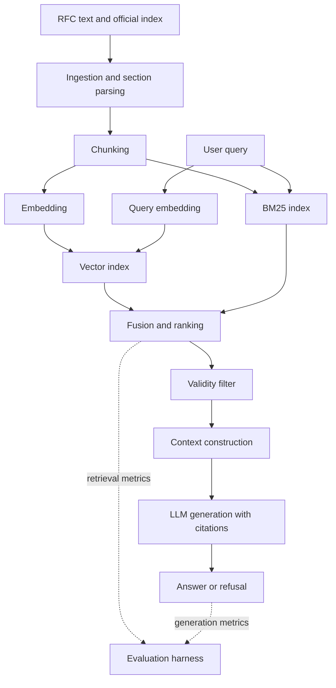

# RFC RAG Evaluation

Retrieval-augmented question answering over HTTP protocol specifications, built
as a measurement harness rather than a demo: every pipeline design decision is a
named configuration, and every configuration is scored on retrieval and on
generation separately.

> **Status: specification.** Nothing here is implemented yet. This README is the
> design document the implementation will follow. Every results table below is
> deliberately empty — no metric in this repository has been measured, and none
> should be quoted until it has.

---

## Motivation

"Can a language model answer a question from a retrieved passage?" stopped being
an interesting question some time ago. The questions that remain are the ones a
demo never has to answer: which retrieval decisions actually move answer
quality, what they cost in latency, and what the system does when retrieval is
wrong but the model answers confidently anyway.

Those questions are only sharp if the corpus makes them sharp. A folder of PDFs
does not. This project uses the HTTP specification family, because it has three
properties that a convenience corpus lacks:

1. **Documents supersede one another.** RFC 2616 (1999) was obsoleted by
   RFC 7230–7235 (2014), which were themselves obsoleted by RFC 9110–9112
   (2022). Large parts of the superseded text remain semantically near-identical
   to the current text. A retriever ranking on embedding similarity alone will
   return the 1999 wording for a question about current HTTP semantics, and the
   generator has no way to know it is reading a withdrawn document. This is a
   correctness failure that prompt engineering cannot reach, and it is invisible
   to any metric that only asks whether the retrieved passage is *on topic*.

2. **The text is identifier-dense.** `Retry-After`, status code `429`,
   `Section 9.3.1`, `RFC 9111`. The working hypothesis — to be tested, not
   assumed — is that exact identifiers like these are poorly served by semantic
   similarity alone: they are short, low-context and arbitrary, so the
   embedding of a query containing one may not place it near the passage that
   defines it. If that holds, lexical matching is a useful complementary signal
   on a real and measurable slice of the query distribution rather than a
   legacy technique. Whether it holds is an experimental question, and the
   identifier query category and the BM25 diagnostic below exist to answer it.

3. **It is deeply structured and heavily cross-referencing.** Definitions live
   in one section and are used twenty sections away. Section numbering is
   meaningful. Where you cut the document is not a formatting detail — it
   decides whether a retrieved chunk is self-contained or a fragment that has
   lost its subject.

The project question follows directly:

> On a corpus with superseding documents, dense identifiers and strong internal
> structure, how much of retrieval quality is decided by pipeline *design* —
> how documents are cut and which signals are ranked on — and how much by the
> knobs that RAG write-ups usually tune?

## Objectives

The project will investigate, in order:

1. Whether structure-aware chunking beats fixed-size windowing on a corpus whose
   structure is explicit, and on which query categories the difference shows up.
2. Whether adding a lexical retrieval signal to a dense retriever helps, whether
   any help is concentrated in identifier-style queries as hypothesised, and how
   much of that help lexical retrieval delivers on its own.
3. Whether document-validity metadata can suppress confidently-wrong answers
   sourced from obsoleted specifications by default, and at what cost in
   recall — including the cost of wrongly suppressing a query that names an
   old RFC on purpose, which is the failure mode in the opposite direction.
4. How much of the remaining error is a retrieval problem and how much is a
   generation problem — measured separately, not inferred from end-to-end
   answer quality.

Equally important, what this project will **not** do, and why:

| Not investigated | Reason |
|---|---|
| Embedding-model comparison | Swapping a checkpoint is a procurement decision, not a design one, and it is the most-reported and least-transferable RAG comparison there is. Held fixed so the experiments isolate pipeline structure. Noted as an extension. |
| Vector database comparison | At this corpus size exact search is correct and fast. Benchmarking database products would measure the products, not the retrieval design. |
| Prompt tuning | A moving target that would confound every configuration comparison. One prompt, fixed across all runs, reported verbatim. |
| Agentic / multi-hop orchestration | Out of scope at this size. The multi-section query category measures whether it *would* be needed, which is the useful precursor. |

## System Architecture

```
RFC plain text + official index
   -> ingestion:       strip page artefacts, parse the section tree, attach status metadata
   -> chunking:        fixed-window (baseline) or section-aware with header path
   -> embeddings:      one fixed sentence-embedding model
   -> retrieval:       exact dense search, optionally fused with BM25
   -> validity filter: current vs obsoleted documents
   -> context:         assembled with per-chunk source attribution
   -> generation:      answer with citations, or explicit refusal
   -> evaluation:      retrieval metrics and generation metrics, scored separately
```



The dotted edges matter more than they look. Retrieval is scored from the
ranking, before any model sees it, so a retrieval regression cannot be masked by
a generator that happens to know the answer from pretraining.

## Dataset / Knowledge Base

The HTTP core specifications and their superseded predecessors — 16 documents,
split deliberately into a current set and an obsoleted set that covers much of
the same ground.

| Set | Documents |
|---|---|
| Current | 9110 Semantics · 9111 Caching · 9112 HTTP/1.1 · 9113 HTTP/2 · 9114 HTTP/3 · 7541 HPACK · 9204 QPACK · 6265 Cookies |
| Obsoleted | 2616 HTTP/1.1 · 7230–7235 (the six-part 2014 split) · 7540 HTTP/2 |

Why this corpus:

- **Public and stable.** RFCs are published as plain text at fixed, permanent
  URLs and do not change once issued. Reproducibility costs nothing.
- **The supersession graph is machine-readable.** `rfc-index.xml` from the RFC
  Editor carries `obsoletes` / `obsoleted-by` / `updates` relationships, so
  validity metadata is parsed from an authoritative source rather than
  hand-curated. Ingestion has a real, bounded parsing task.
- **Plain text with structure and artefacts.** Numbered section trees to parse,
  and page headers, footers and form feeds to strip — which is genuine
  preprocessing work, not busywork, because those artefacts otherwise land in
  the middle of chunks.
- **Small enough to stay honest.** Order of 1,200 pages and, depending on
  configuration, roughly 5,000–8,000 chunks. Exact search over that is
  instantaneous on a laptop, so no result is confounded by approximate-search
  recall loss. Figures to be confirmed at ingestion.
- **Adjacent to the rest of my portfolio.** Protocol specifications sit next to
  the systems-programming work rather than repeating the ML work.

**No document text is committed.** `scripts/fetch_corpus.py` downloads the 16
RFCs and the index, with an on-disk cache, the same pattern used in my other
repositories. This keeps the repository small and avoids redistributing text
whose terms vary by publication year.

**The obsoleted set stays fully indexed and retrievable in every
configuration, including the ones with no validity handling at all.** This is
deliberate, not an oversight: obsoleted text is what *creates* the stale-answer
failure mode, so C0–C2 need it embedded and competing for rank in order for
there to be anything to measure. If the obsoleted documents were left out of
the index entirely, the "stale evidence rate" would be zero by construction —
not because the system got anything right, but because the failure mode had
nowhere to happen. Only C3 adds a rule on top of the same index that suppresses
or down-weights obsoleted matches; the documents themselves are never removed.
This also keeps the corpus able to answer a query that names an old RFC on
purpose (see the *explicit historical version* category below) — a corpus that
had quietly dropped the obsoleted text could never do that, regardless of what
the retrieval logic asked for.

## Evaluation Dataset

Roughly **65 queries** at full size, hand-written before any retrieval output is
inspected, so that the set measures the system rather than being shaped by it.
Provenance for each query is recorded.

**The set is built in two passes, not all at once.** The MVP needs only 25–30
queries covering the first three categories — enough to measure C0 against C1
and get real numbers out of a working pipeline early. Superseded, unanswerable
and explicit-version queries are written in the second pass, once retrieval is
trustworthy and the configurations those categories exist to discriminate (C2,
C3) are actually being built. Writing all of it up front would mean spending
the first week on a benchmark for an implementation that has not yet been
validated.

| Category | Count | What it tests | Written in |
|---|---:|---|---|
| Direct factual | 20 | Single-section answer. The floor: if this is weak, nothing else matters. | MVP |
| Identifier lookup | 10 | Exact header name, status code, section or RFC number. The category that tests the lexical-retrieval hypothesis. | MVP |
| Multi-section | 12 | Evidence in two or more sections, often across documents via a cross-reference. | MVP |
| Superseded | 10 | Answerable from both an obsoleted and a current RFC, where only the current answer is correct. The trap in one direction: assume current unless told otherwise. | Phase 2 |
| Explicit historical version | 6 | Names an old RFC directly (e.g. "In RFC 2616, how is chunked encoding framed?"), where the obsoleted document is the *correct* answer. The trap in the opposite direction: an over-eager validity filter must not suppress a version the user explicitly asked for. | Phase 2 |
| Unanswerable | 8 | Plausible, on-topic, and genuinely not in the corpus. Correct behaviour is refusal. | Phase 2 |

Recorded per query:

```yaml
id: q017
query: "What does a server send when it rejects a request for exceeding a rate limit?"
category: identifier_lookup
difficulty: medium
gold_sections:                  # the unit of truth - see below
  - {rfc: 6585, section: "4"}
gold_documents: [6585]
reference_answer: "429 Too Many Requests, optionally with a Retry-After header."
expected_behaviour: answer      # answer | refuse
distractor_sections:            # for superseded and explicit-version queries -
  - {rfc: 2616, section: "10.4"}    # the source that must NOT win
notes: "Tests whether the exact status code token survives dense-only retrieval."
```

An *explicit historical version* query inverts which document is gold and
which is the distractor, versus a *superseded* one:

```yaml
id: q052
query: "In RFC 2616, how is a chunked message body terminated?"
category: explicit_historical_version
difficulty: medium
gold_sections:
  - {rfc: 2616, section: "3.6.1"}   # the obsoleted document is correct HERE
gold_documents: [2616]
reference_answer: "By a chunk of size zero, optionally followed by trailer headers."
expected_behaviour: answer
distractor_sections:                # the current RFC must NOT override the ask
  - {rfc: 9112, section: "7.1.1"}
notes: "Tests whether validity filtering (C3) over-corrects and suppresses a
  version the query named on purpose."
```

**Gold labels are at section granularity, not chunk granularity.** This is the
single most important design decision in the evaluation harness. Chunk
boundaries change between configurations, so chunk-level gold labels would have
to be re-annotated for every configuration — and the configurations would then
no longer be comparable, because each would be scored against its own labels.
Labelling the *section* that contains the evidence, and mapping every chunk back
to exactly one section at index time, makes one fixed label set valid across all
configurations. A chunk counts as a hit when it maps to a gold section.

## Retrieval Evaluation

Scored directly from the ranking, with no model in the loop.

| Metric | Why |
|---|---|
| **Recall@k** (k = 5, 10) | The primary metric. What decides whether an answer is possible at all is whether the needed evidence reached the context window. For multi-gold queries this is the fraction of gold sections retrieved, not a binary. |
| **MRR@10** | Rank position matters as soon as context is truncated, or a reranker is added downstream. Recall@k alone hides the difference between rank 1 and rank 9. |
| **Hit rate@k** | At least one gold section retrieved. A weaker complement to Recall@k, reported because for some query types partial evidence is still useful. |
| **Precision@k** | Reported, not used for decisions. With fixed k it is mechanically bounded by the gold-set size over k, so it mostly measures how many gold sections a query happens to have. |
| **Stale evidence rate** | Project-specific: share of retrieved context drawn from obsoleted documents when a current document covers the question. The metric the generic RAG stack has no reason to define, and the one this corpus exists to expose. |

All metrics reported **per category as well as overall**. An aggregate that
improves while the superseded category degrades is a regression being hidden by
an average, and the per-category table is what makes that visible.

## Generation Evaluation

> **Second phase, not the MVP.** Nothing in this section is required for the
> first milestone. Retrieval evaluation has to be working and trustworthy before
> any of it is built — a generation metric computed on top of an untrusted
> retrieval score is a number with no interpretation. In particular, the
> LLM-as-judge harness is the last thing to be implemented, not the first.

Deliberately weighted towards things that can be checked programmatically, with
model-judged metrics used only where nothing cheaper works.

| Metric | How | Objective? |
|---|---|---|
| **Citation validity** | Every answer must cite `RFC <n> §<section>`. Parse the citations; check each one exists in the context that was actually supplied. | Fully |
| **Citation relevance** | Do the cited sections intersect the query's gold sections? | Fully |
| **Refusal behaviour** | Refusal rate on the unanswerable category; false-refusal rate on answerable ones. Both matter — a system that refuses everything scores perfectly on the first. | Fully |
| **Staleness of answer** | Does the answer cite an obsoleted RFC where a current one covers the question? | Fully |
| **Answer correctness** | LLM-as-judge against the reference answer, three-level rubric: correct / partially correct / incorrect. | Judged |
| **Faithfulness** | LLM-as-judge, claim-level, with the supplied context: is every assertion supported by it? | Judged |

The two judged metrics get a reliability check rather than a free pass: I will
label a 20-query subsample by hand and report **judge–human agreement**. If
agreement is poor, the judged numbers are reported as indicative and the
objective metrics carry the conclusions. A judge whose agreement is never
measured is an unvalidated instrument.

Faithfulness and correctness are kept apart on purpose. An answer can be
perfectly faithful to a retrieved passage that is the wrong passage — that is
precisely the superseded-document failure, and collapsing the two metrics would
hide it.

## Experiments

An ablation ladder, not a grid. Each configuration adds exactly one change to
the one above it, so any difference in the table has a single named cause. Four
rungs, plus one diagnostic run that sits outside the ladder — not a
hyperparameter sweep.

| Config | Chunking | Retrieval | Validity | Question it answers |
|---|---|---|---|---|
| **C0** baseline | Fixed 800-char window, 150 overlap | Dense only, top-k 5 | none | What does the default pipeline get? |
| **C1** | Section-aware, header path prefixed, artefacts stripped | Dense only, top-k 5 | none | Does respecting document structure beat fixed windows? |
| **C2** | = C1 | Dense + BM25, fused with RRF, top-k 5 | none | Does a lexical signal help, and is the help concentrated in identifier queries? |
| **C3** | = C2 | = C2 | Obsoleted documents filtered or down-weighted | Can validity metadata remove stale answers, and what does it cost in recall? |

Held fixed across all four: embedding model, k, prompt, generation model,
temperature, and the evaluation set. `top-k = 5` is the starting point, not a
tuned value; a small k-sensitivity check (k in {3, 5, 10}) on the best
configuration is planned so that the choice is reported as measured rather than
asserted.

Two things deliberately left out of the ladder and moved to extensions: a
cross-encoder reranker and query rewriting. Both are likely to help; both would
also make it impossible to attribute a gain to the four decisions above.

### D1 — BM25-only diagnostic

One additional run, **not a rung of the ladder**, over the same section-aware
chunks as C1 and C2: BM25 alone, no dense component.

It exists to answer a single follow-up question that C2 on its own cannot:

> If hybrid retrieval improves identifier queries, how much of that improvement
> is simply lexical retrieval, and how much comes from combining the two
> signals?

Without D1, a gain from C1 to C2 is ambiguous — it could mean fusion is working,
or it could mean the dense component was contributing little on those queries all
along. The comparison that carries the answer is C1 / D1 / C2 on the identifier
category specifically.

Scope limits, so this stays a diagnostic rather than becoming a second project:

- Reported for **retrieval metrics and the per-category breakdown only**. No
  generation run, no latency or cost accounting, no error analysis pass.
- Listed separately from C0–C3 in every table, so the causal ladder stays
  readable.
- No BM25 parameter tuning. Library defaults, recorded.

## Metrics and Reporting

The tables the finished README must contain. Empty until measured.

**Retrieval**

| Config | Recall@5 | Recall@10 | MRR@10 | Hit rate@5 | Stale evidence rate |
|---|---:|---:|---:|---:|---:|
| C0 | — | — | — | — | — |
| C1 | — | — | — | — | — |
| C2 | — | — | — | — | — |
| C3 | — | — | — | — | — |
| *D1 (diagnostic)* | — | — | — | — | — |

**Retrieval by query category** (Recall@5)

| Config | Direct factual | Identifier | Multi-section | Superseded | Explicit version |
|---|---:|---:|---:|---:|---:|
| C0 | — | — | — | — | — |
| C1 | — | — | — | — | — |
| C2 | — | — | — | — | — |
| C3 | — | — | — | — | — |
| *D1 (diagnostic)* | — | — | — | — | — |

The **Explicit version** column is where C3's validity filter has to earn its
keep: it needs Superseded to go up without dragging Explicit version down. A
C3 that wins on the trap and loses on the counter-trap has not solved the
problem, it has moved it.

Unanswerable has no column here — there is no gold section to recall against a
query with no answer in the corpus. It is scored on generation instead
(refusal rate, below).

D1 appears in the retrieval tables only. It is not run through generation, so it
has no row in the generation or latency tables below.

**Generation**

| Config | Answer correctness | Faithfulness | Citation validity | Citation relevance | Refusal on unanswerable | False refusal | Stale answers |
|---|---:|---:|---:|---:|---:|---:|---:|
| C0 | — | — | — | — | — | — | — |
| C1 | — | — | — | — | — | — | — |
| C2 | — | — | — | — | — | — | — |
| C3 | — | — | — | — | — | — | — |

**Latency and cost**

| Config | Retrieval p50 | Retrieval p95 | End-to-end p50 | End-to-end p95 | Tokens in | Tokens out | Cost / 100 queries |
|---|---:|---:|---:|---:|---:|---:|---:|
| C0 | — | — | — | — | — | — | — |
| C1 | — | — | — | — | — | — | — |
| C2 | — | — | — | — | — | — | — |
| C3 | — | — | — | — | — | — | — |

Every table is to be generated from `results/` by a script, never typed by hand.

## Error Analysis

Every failing query in the best and worst configurations gets read and assigned
one category. This is the part that produces the things worth saying in an
interview, and it cannot be automated.

| Category | Definition |
|---|---|
| Document miss | No chunk from the correct document retrieved at all. |
| Ranked too low | Correct chunk retrieved, but below the cut-off. |
| Chunk boundary failure | The gold section was split so that the answer sits across two chunks and neither is self-contained. |
| Context incomplete | Right section, but the answer needs a definition or cross-reference that was not retrieved. |
| Stale evidence | Obsoleted document retrieved and used where a current one covers the question. |
| Hallucination despite correct context | Correct evidence present; answer still wrong. A generation failure, not a retrieval one. |
| Unsupported but answered | Out-of-corpus question answered instead of refused. |
| Ambiguous query | The query admits more than one reasonable reading, and the gold label picked one. An evaluation-set defect, to be recorded rather than quietly fixed. |

Counts per category, per configuration, with two or three worked examples
reproduced in full.

## Latency and Cost

Measured per stage, not just end-to-end, because the whole trade-off argument
depends on knowing which stage the time went to.

| Stage | Instrumented |
|---|---|
| Query embedding | yes |
| Dense search | yes |
| BM25 + fusion | yes, C2/C3 only |
| Validity filtering | yes, C3 only |
| Context assembly | yes |
| Generation | yes, first token and total |
| End to end | yes |

Reported as p50 and p95 over the full evaluation run, not a single-query
stopwatch reading. The expectation to be tested is that generation dominates by
an order of magnitude and the retrieval-side differences between C0 and C3 are
small in absolute terms — which, if it holds, is the actual answer to "what is
the quality/latency trade-off here?" and is a much more useful sentence than a
mean latency number.

**Cost.** Token counts in and out are logged per query and aggregated per
configuration, with the price table and date recorded alongside. If the local
path is used instead, cost is replaced by documented hardware, model build and
wall-clock — an unpriced local run is not free, and saying so is part of the
analysis.

## Testing

Small and targeted. Roughly ten tests, aimed at the places where a silent bug
would corrupt every number in every table.

| Test | Why |
|---|---|
| Page artefacts stripped from a fixture RFC | Headers and footers inside chunks poison embeddings invisibly. |
| Section tree parsed to expected ids on a fixture | Everything downstream keys off section ids. |
| Chunking is deterministic and respects the size bound | Non-determinism here silently invalidates run-to-run comparison. |
| Every chunk maps to exactly one section | The mapping is the basis of all gold matching. A partial mapping would inflate or deflate recall with no visible symptom. |
| Retrieval returns the documented schema | Cheap contract test. |
| Empty and whitespace-only query rejected | Obvious edge case. |
| Missing or stale index fails loudly | Silent fallback to an empty index would score as a total retrieval failure and look like a model problem. |
| RRF fusion invariant to input ordering | Easy to get subtly wrong. |
| Metrics verified against hand-computed rankings | **The most important test here.** A bug in Recall@k or MRR does not crash — it produces plausible numbers, and every conclusion in the repository inherits it. |
| Unanswerable fixture triggers the refusal path | The refusal behaviour is a claimed feature, so it gets a test. |

## Planned Repository Structure

```
src/
  ingestion/      fetch, artefact stripping, section-tree parsing, index metadata
  chunking/       fixed-window and section-aware strategies, chunk-to-section mapping
  retrieval/      embedding, dense index, BM25, RRF fusion, validity filter
  generation/     prompt, context assembly, citation parsing, refusal handling
  evaluation/     retrieval metrics, generation metrics, judge harness, reporting
tests/
data/             corpus cache, git-ignored, populated by scripts/fetch_corpus.py
eval/             the query set and its schema, committed
results/          per-configuration metrics, timings, raw answers, committed
scripts/          fetch_corpus.py, build_index.py, run_eval.py, make_tables.py
configs/          one YAML per configuration C0-C3
```

Four scripts and a config file per experiment. No service layer, no web
frontend, no container orchestration — none of it would demonstrate anything the
evaluation does not already demonstrate better.

## Reproducibility

- **Configuration as data.** One YAML per configuration, covering chunking,
  retrieval, k, models and prompt version. Nothing that affects a result lives
  in a function default.
- **Pinned dependencies**, with the Python version recorded.
- **Seeds** fixed and recorded. Retrieval is deterministic by construction;
  generation runs at temperature 0, which reduces variance without eliminating
  it. Where a hosted model is used, the model version and date are recorded, and
  the fact that determinism is not guaranteed is stated rather than assumed
  away.
- **Results are artefacts.** Each run writes metrics, timings and raw answers to
  `results/<config>/`, stamped with the config hash and corpus checksum. README
  tables are generated from those files.
- **The evaluation set is committed** and versioned. If a query is corrected
  after error analysis, the change is a visible commit, not a silent edit.

## Operational Considerations

Not implemented — a design note, because "how would you run this in production?"
is a fair question to ask of any RAG system.

The useful observation is that two of this project's metrics need no labels and
can therefore run online: **citation validity** and **refusal rate**. Both are
computed from the answer and the context alone, which makes them live health
signals rather than offline evaluation. Add retrieval score distribution
(a shifted distribution after an index rebuild usually means an ingestion bug),
p95 latency per stage, and the share of answers citing obsoleted documents.

Beyond that: re-run the committed evaluation set against every index rebuild as
a regression gate, and log the retrieved chunk ids with each answer so any
complaint can be traced to the ranking that produced it.

## Limitations

Stated in advance, since most of them are consequences of the design rather than
things that might go wrong.

- **Sixty-odd queries is a small evaluation set**, and the new *explicit
  historical version* category shrinks the six-query cell further still.
  Differences of a few points between configurations will not be statistically
  meaningful. Bootstrap confidence intervals will be reported so the size of
  that problem is visible rather than implied.
- **One person wrote both the system and the evaluation set.** Writing the
  queries before inspecting any retrieval output limits the bias; it does not
  remove it.
- **Section-level gold labelling favours long sections**, which are easier to
  hit. The section-length distribution will be reported alongside the metrics.
- **The superseded-query category is constructed.** It shows the failure mode
  exists and can be measured; it says nothing about how often real users would
  hit it.
- **One corpus, one language, one domain, one embedding model.** Nothing here
  establishes that the ranking of C0–C3 transfers to a different corpus. The
  method is the transferable part, not the numbers.
- **Exact search removes approximate-search recall loss** from the picture
  entirely. That is the right choice at this size and the wrong assumption at
  scale, and the results should not be read as applying to an ANN deployment.
- **LLM-as-judge is a proxy**, mitigated by measuring agreement rather than by
  assertion.
- **Single-turn only.** No conversational context, no follow-up resolution.

